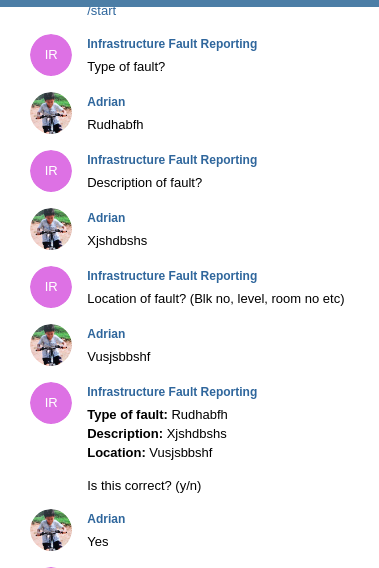
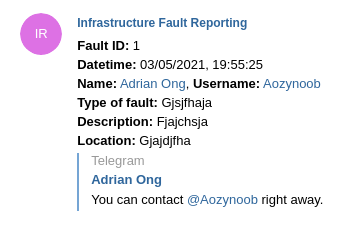
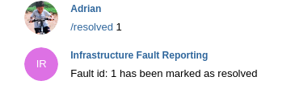
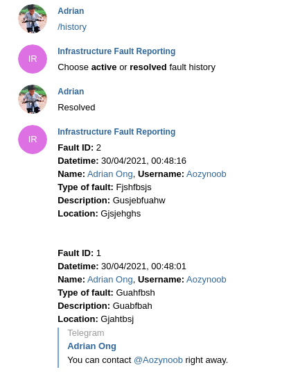

# Infrastructure fault reporting bot
This project is a Telegram implementation of a fault reporting bot in Python

## Aim of the bot
This bot aims to ease availability choke point faced when a single user is responsible for handling newly reported faults.
Acting like a middleman, the bot can then swiftly disseminate newly reported faults to the appropriate personnel.

## Screenshots
Submitting a new fault (/start)
<br />


What other users see
<br />


Resolving a fault (/resolved {fault_id})
<br />


Fault tracking (/history)
<br />



## Core framework/concepts used
- Python-telegram-bot

Python interfaces for Telegram API, includes high level classes to make the development of bots easy and straightforward

## Getting started
Follow the steps in order below

### Prerequisites
You will need to have these installed before doing anything else

- Python- 3.8.1 and above https://www.python.org/downloads/

### Installation
- Installing Python packages
```
# cd into the root folder of the project
# Change the path accordingly to your system
cd /home/ns-digitalization-bot

# You should have pip installed as it comes with installing Python
# Installing python packages
pip install -r requirements.txt
```

## Usage
- Load environment variables

Make sure you have the following variables defined in ```.env``` file
1. bot_token 
   
API token of the bot, can be created via @BotFather

1. recipient_list
   
Telegram chat id for users who want to be notified by the bot for new faults (Separated by comma for multiple users)

```
# Load environment variables
source .env
```
- Run bot
```
# Make sure your in the root directory of the project
python run.py
```

- Chat with the bot

Check ```run.py``` for documentation for each commands
```
Bot commands:
/history
/start
/resolved {fault_id}
```

## References
Toledo, L. (2015). Welcome to Python Telegram Bot’s documentation! — python-telegram-bot 13.5 documentation. Retrieved 23 May 2021, from https://python-telegram-bot.readthedocs.io/en/stable/index.html

